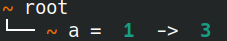
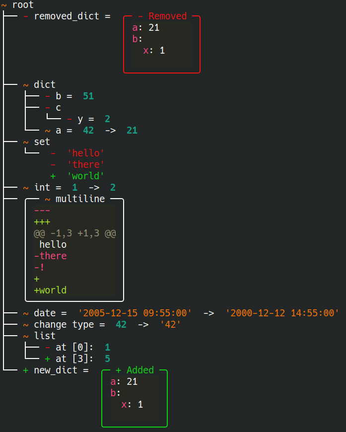

# DeepDiff Viewer

A simple utility to visualize DeepDiff in the terminal. Support
[rich](https://github.com/Textualize/rich) for even prettier renders.

## Install

```bash
pip install deepdiff_viewer
```

To use the `RichViewer` class:

```bash
pip install deepdiff_viewer[rich]
```

## Usage

Simple usage:

```python
from deepdiff import DeepDiff
from deepdiff_viewer.rich import RichViewer

t1 = {"a": 1}
t2 = {"a": 3}

ddiff = DeepDiff(t1, t2, view="tree")
viewer = RichViewer(ddiff)
print(viewer.render())
```

## Examples

See the [examples/](./examples) folder.





## Concepts

The `DeepDiffTreeViewer` class wraps a `DeepDiff` object that was built with
the [`tree` view mode](https://zepworks.com/deepdiff/current/view.html). It
generates a tree of all the differences found in the `DeepDiff` object so that
it can be rendered.

Currently the only implemented viewer is the `RichViewer` but you can
extend the `DeepDiffTreeViewer` base class to make your own viewer if you want
to use something else than `rich`.

## License

MIT
